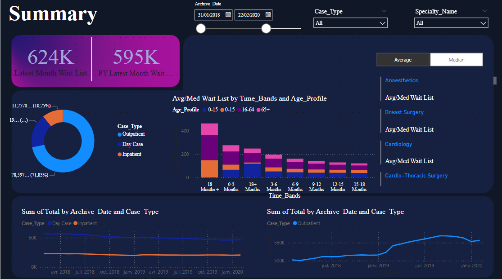
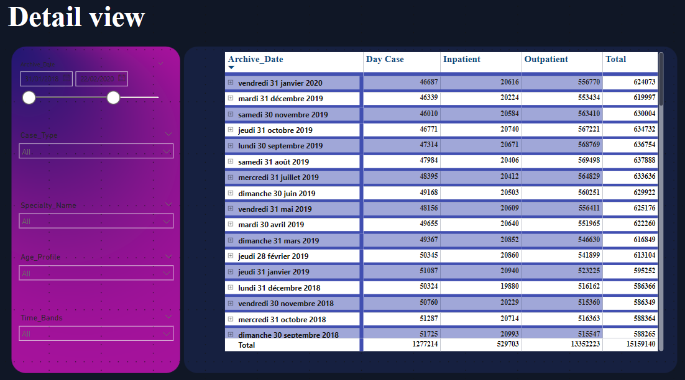

# Healthcare Dashboard Project

## Project Overview
This project involves creating an interactive and insightful dashboard in Power BI to visualize, monitor, and analyze the patient waiting lists across multiple metrics. The dashboard provides a high-level summary as well as detailed insights into specific specialties, age profiles, and waiting list trends over time. 

## Problem Statement
The primary goal of this project is to address the healthcare organization's need to manage and understand patient waiting lists more effectively. By tracking current and historical data, the dashboard enables stakeholders to monitor trends and identify areas for improvement in patient management.

## Objectives
1. **Track the current status of the patient waiting list** for real-time decision-making.
2. **Analyze historical trends** in waiting lists across Inpatient and Outpatient categories.
3. **Provide a detailed analysis** at specialty and age profile levels to identify bottlenecks and improvement areas.

## Data Scope
- **Time Period**: 2018 – 2021
- **Data Types**: Inpatient & Outpatient patient waiting list records

## Metrics
The dashboard captures several key metrics essential for comprehensive analysis:
- **Average & Median Waiting List**: Understand the central tendencies of the waiting list durations.
- **Current Total Waiting List**: Track the total number of patients on the waiting list in real-time.
## the Dashboard 

## Dashboard Structure

### 1. **Requirement Gathering**
   - Defined key stakeholders' requirements to ensure that all necessary insights are covered by the dashboard.

### 2. **Data Collection**
   - Collected and consolidated waiting list data for the years 2018 – 2021, including patient categories, specialty, and age profile details.

### 3. **Data Transformation & Modeling**
   - Performed data cleansing, transformations, and modeling to ensure accuracy and usability in Power BI.
   - Created relationships among tables to enable drill-down and filtering capabilities in the dashboard.

### 4. **Data Visualization Blueprint**
   - Designed a blueprint to organize and arrange the dashboard's visuals, metrics, and filters for a user-friendly experience.

### 5. **Dashboard Layout & Design**
   - Developed a streamlined layout, structuring the dashboard to include both summary and detailed pages:
     - **Summary Page**: Presents key metrics, trends, and aggregated data.
     - **Detailed Page**: Provides granular insights for deep dives into specific specialties and demographics.

### 6. **Adding Interactivity & Navigation**
   - Enabled interactive features like filters, slicers, and drill-through options to allow users to customize their views and navigate seamlessly.

## Key Views in the Dashboard

### - **Summary Page**
   - An overview of current waiting list statuses, average and median wait times, and a high-level trend analysis.

### - **Detailed Page**
   - Granular analysis page allowing users to delve into specifics, such as specialty-wise distribution and age profiles of patients on the waiting list.

## Technology Stack
- **Power BI**: Used for data visualization and dashboard development.
- **Power Query**: Employed for data transformation and preparation within Power BI.

---

## Getting Started
To view or modify this dashboard, open the Power BI file in Power BI Desktop and ensure the data sources are configured properly.

---

